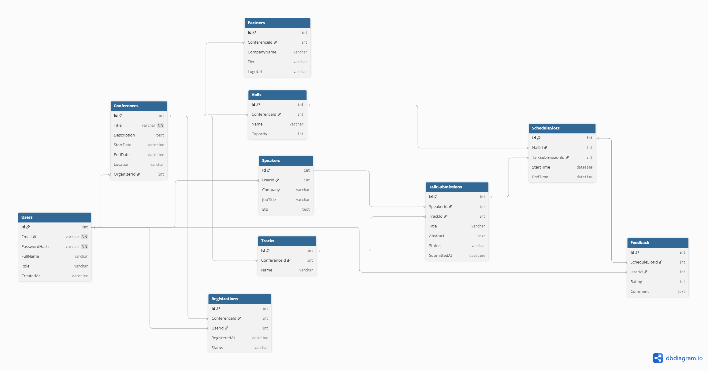

# Платформа управления IT-конференциями (Science & IT Conferences Platform)

Клиент-серверное веб-приложение для организации, планирования и проведения конференций, митапов и научных секций.

## 1. Роли пользователей
- **Гость (Слушатель)**: просматривает календарную афишу событий, ищет доклады по темам и спикерам, регистрируется на мероприятие.
- **Спикер**: подает заявки на доклады (Call for Papers), указывает аннотацию и уровень сложности, отслеживает статус модерации.
- **Организатор конференции**: создает мероприятие, определяет доступные аудитории/залы, модерирует поток заявок от спикеров и составляет финальное расписание.
- **Администратор системы**: управляет глобальными справочниками, пользователями и блокировками.

## 2. Ключевые сценарии использования (Use Cases)

### UC-1: Регистрация слушателя на конференцию
- **Предусловие**: Пользователь открыл карточку конференции.
- **Основной сценарий**:
  1. Пользователь нажимает кнопку «Зарегистрироваться».
  2. Система проверяет наличие свободных мест в залах.
  3. Создается запись регистрации, статус меняется на «Подтверждено».
  4. Пользователь видит конференцию в списке своих бронирований.

### UC-2: Подача заявки на доклад спикером
- **Предусловие**: Спикер авторизован в системе.
- **Основной сценарий**:
  1. Спикер переходит на страницу сбора заявок (CFP) нужной конференции.
  2. Заполняет форму: название, тезисы, длительность, теги, требуемое оборудование.
  3. Отправляет заявку. Система присваивает заявке статус `Submitted`.
  4. Заявка отображается в личном кабинете спикера и в очереди модерации организатора.

### UC-3: Модерация заявки и формирование расписания организатором
- **Предусловие**: Организатор находится в панели управления конференцией.
- **Основной сценарий**:
  1. Организатор просматривает список поступивших заявок.
  2. Выбирает заявку и нажимает «Одобрить» (статус меняется на `Approved`).
  3. Переходит в сетку расписания, выбирает зал и свободный временной интервал.
  4. Назначает доклад на временной слот. Доклад становится виден в публичной программе.

### UC-4: Просмотр событий через календарную сетку
- **Предусловие**: Любой пользователь заходит на главную страницу.
- **Основной сценарий**:
  1. Система запрашивает список событий за выбранный месяц.
  2. Фронтенд отрисовывает дни недели с маркерами событий.
  3. При клике на день открывается подробный список конференций этой даты.

## 3. Ссылки на артефакты
- **Макет интерфейса в Figma**: [Ссылка будет добавлена дизайнером]
- **Репозиторий Backend**: https://github.com/AF1Ma/conf-backend
- **Репозиторий Frontend**: https://github.com/AF1Ma/conf-frontend

  
